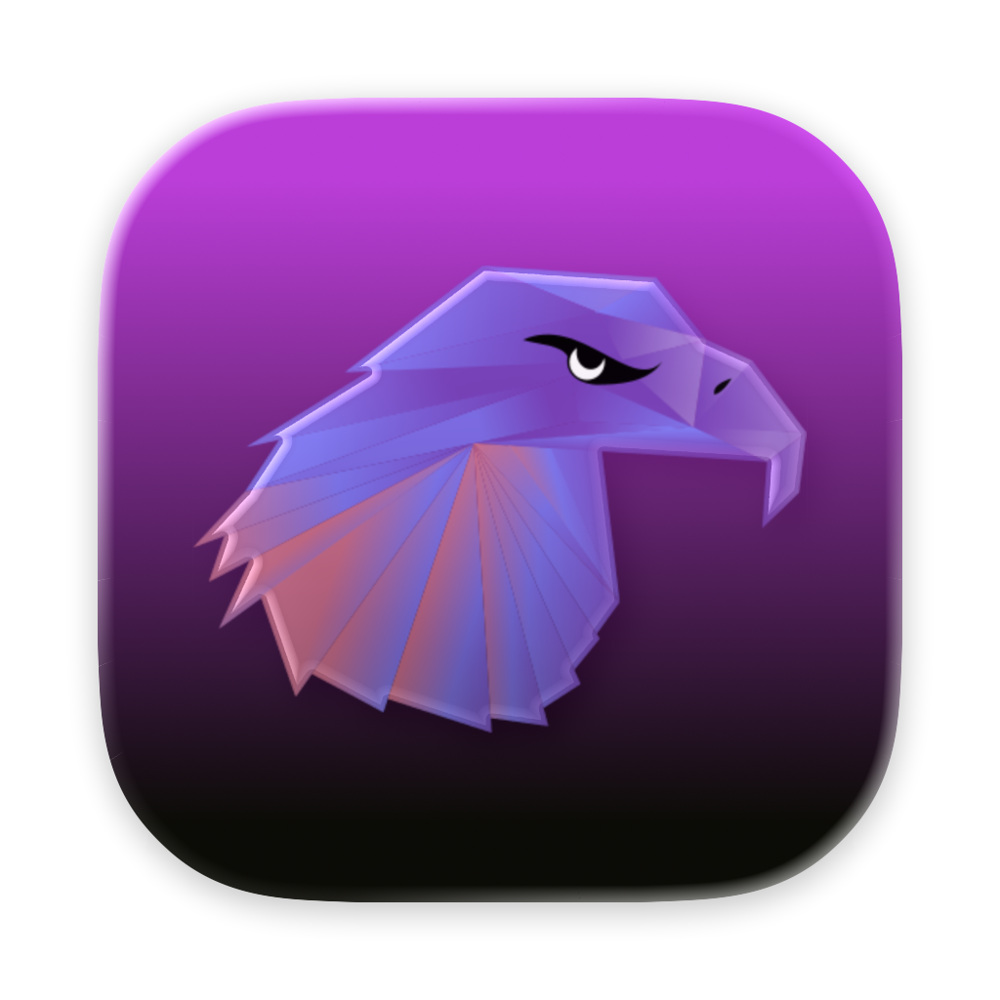
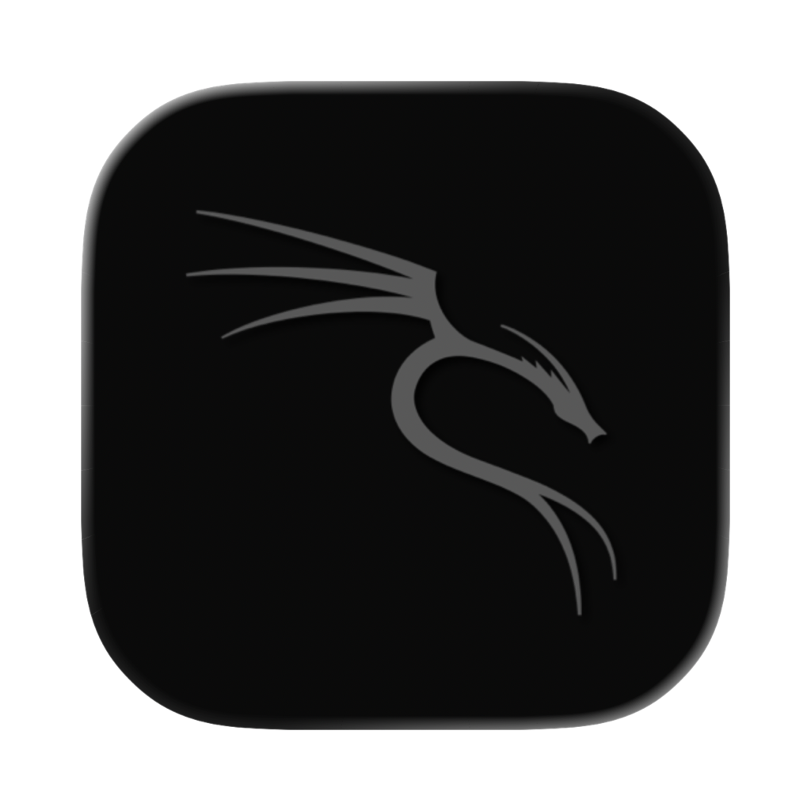
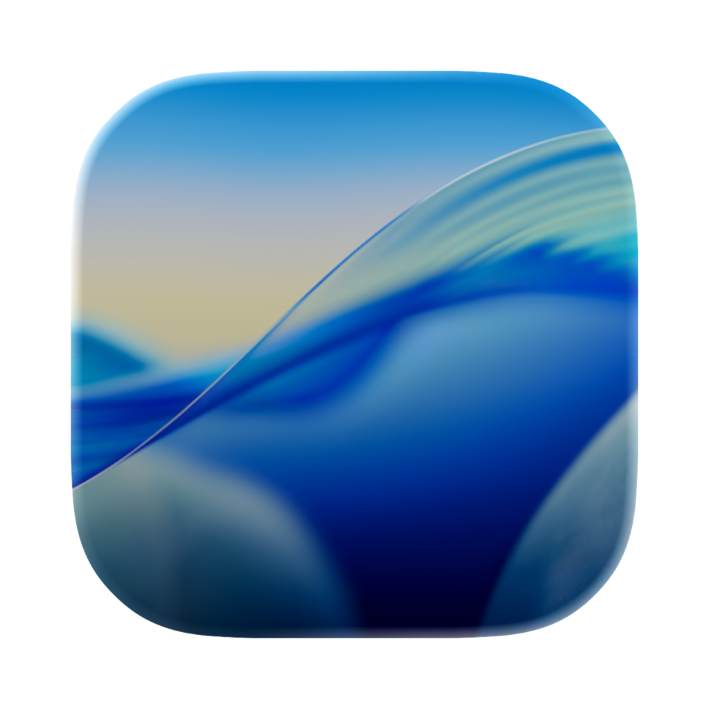
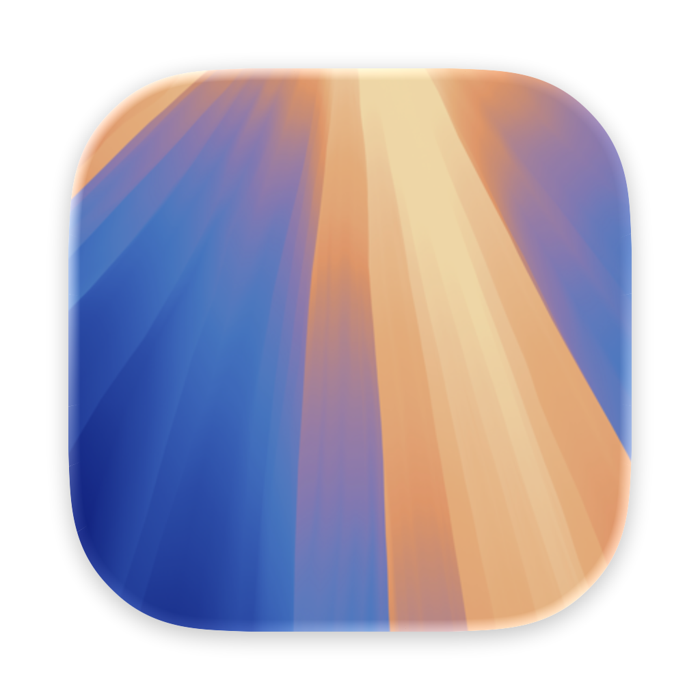
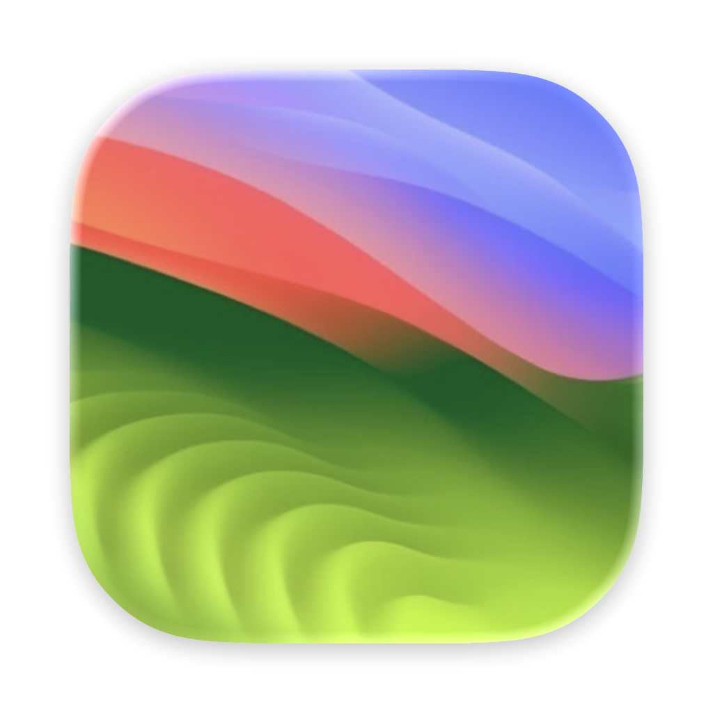
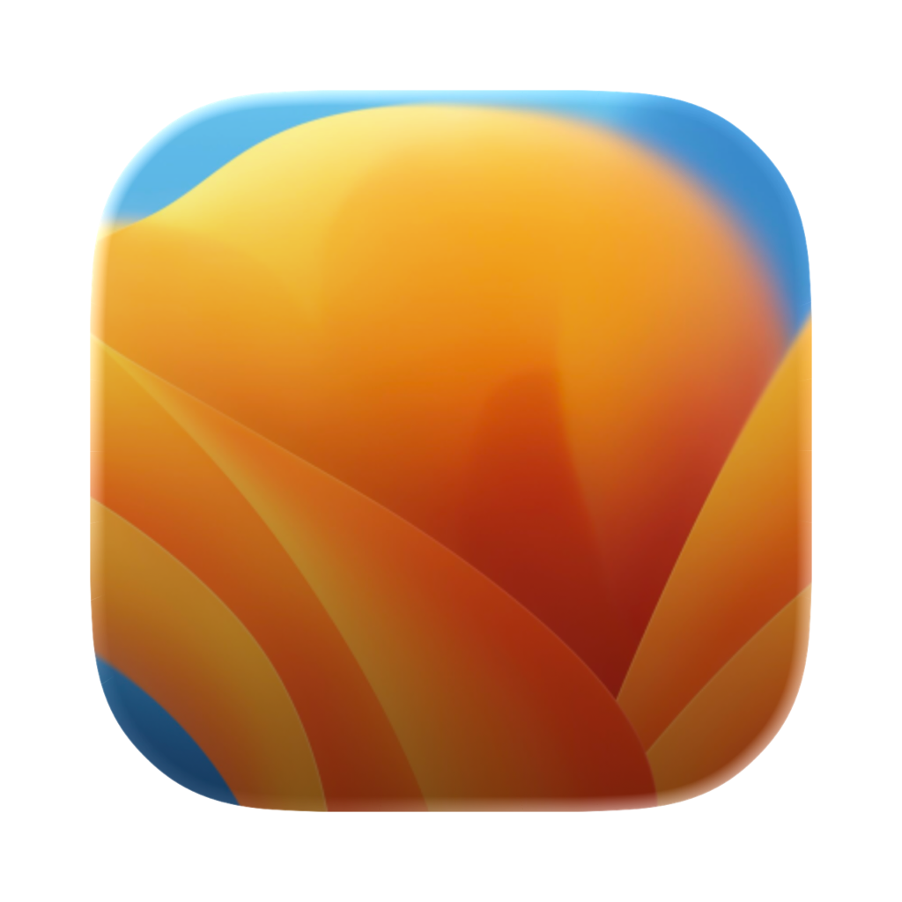
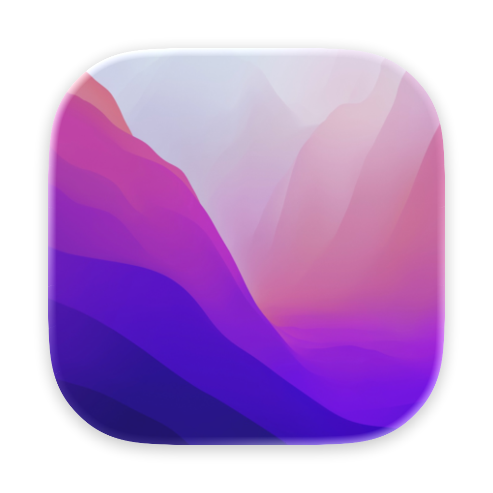
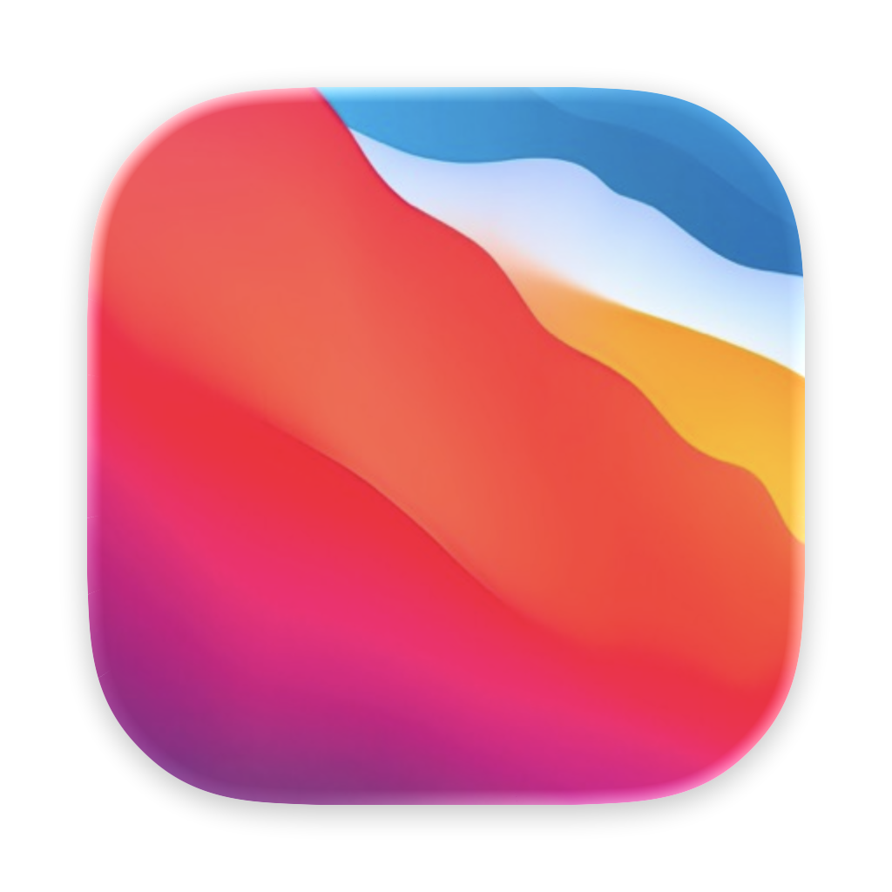

# IconSet-Tahoe-Style-Linux-Mac-Windows
Icon Set Linux, Windows and Mac; built in Tahoe Style Liquid Glass Effects. 
* The images inside `Group_Icons.icon` are those created in full size, `ICON_OUT` are those created in Tahoe Style.
- Built from ➤ [Icon Composer](https://developer.apple.com/documentation/Xcode/creating-your-app-icon-using-icon-composer)
### View ➥ [Full Set](https://github.com/chris1111/IconSet-Tahoe-Style-Linux-Mac/blob/main/View-Set.md)
### Downloads ➦ [Repository](https://github.com/chris1111/IconSet-Tahoe-Style-Linux-Mac/archive/refs/heads/main.zip)

### Discussions ➥ [Discussions](https://github.com/chris1111/IconSet-Tahoe-Style-Linux-Mac/discussions)
### Suggestions of Icon to Add ➥ [Suggestions](https://github.com/chris1111/IconSet-Tahoe-Style-Linux-Mac/discussions/2)
### <a href="https://github.com/chris1111/IconSet-Tahoe-Style-Linux-Mac">IconSet-Tahoe-Style-Linux-Mac</a> © 2026 by <a href="https://github.com/chris1111">chris1111</a> is licensed under <a href="https://github.com/chris1111/IconSet-Tahoe-Style-Linux-Mac/blob/main/LICENSE">MIT</a>
--------------------------------------
  
  

   
  
